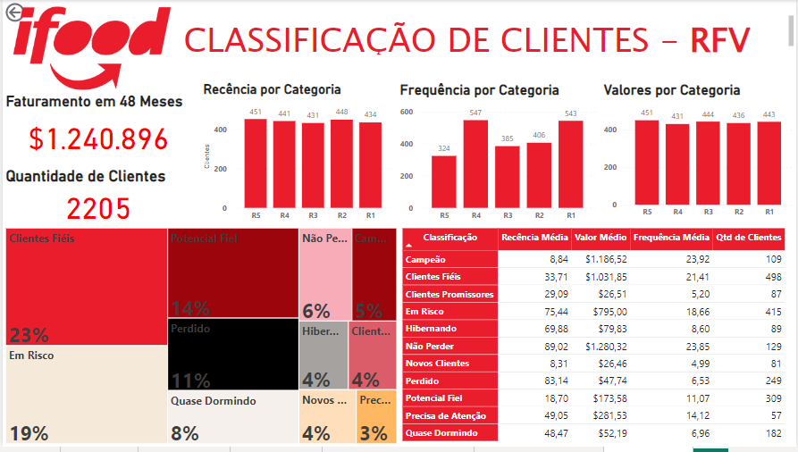

# iFood CRM Data Analyt Case

This is a case used for hiring Data Analysts for the iFood Brain team.  
Avaible at (https://github.com/nailson/ifood-data-business-analyst-test)  

**I did not use this case to an iFood hiring process. The pourpose of this Analysis was to build a portfolio**

### About the Case: 
 
In this case, you are presented a sample dataset, that mocks metainformation on the customer
and on iFood campaign interactions with that customer. 

### Data
The data set contains socio-demographic and firmographic features about 2.240 customers who
were contacted. Additionally, it contains a flag for those customers who responded the campaign,
by buying the product. 
 

### Key Objectives are: 
1. Explore the data – be creative and pay attention to the details. You need to provide the
marketing team a better understanding of the characteristic features ofrespondents; 
2. Propose and describe a customer segmentation based on customersbehaviors; 
3. Create a predictive model which allows the company to maximize the profit of the next
marketing campaign. 
4. Whatever else you think is necessary. 

## Files description

##### ifood_analise.ipynb  
 
Aiming at the key objectives, first, it was performed an exploratory analysis where it was possible to see a client segmentation based on the customer's yearly household income and the amount spent on wine and meat in the last two years.
Based on this, I performed a clusterization using the k-means model. 
 
K-means is a popular clustering algorithm used in machine learning and data mining to group data points into distinct clusters based on their similarity. The algorithm starts by randomly selecting k centroids (i.e., central points) for the clusters and assigning each data point to the closest centroid. The algorithm then iteratively updates the centroids by calculating the mean value of all data points assigned to each cluster, and re-assigning each data point to the nearest centroid.  (text created with ChatGPT)

**To perform k-means model, I used *Python* and *Knime*.**

##### Dashboard_RFV.pbix  
 
In order to have more aswers about the client segmentation it was performed an RFM analysis. 
 
RFM analysis is a marketing technique used to segment customers based on their past behavior, specifically their recency, frequency, and monetary value. Recency refers to how recently a customer has made a purchase, frequency refers to how often a customer has made a purchase, and monetary value refers to how much a customer has spent on purchases.

RFM analysis assigns a score to each customer based on these three metrics, which are then used to segment customers into groups such as "high-value," "medium-value," and "low-value" customers. These segments can then be used to tailor marketing strategies and campaigns to each group of customers, such as offering promotions or discounts to high-value customers to encourage repeat purchases.

RFM analysis can provide valuable insights into customer behavior and preferences, as well as help businesses optimize their marketing efforts to increase customer retention and loyalty. (text created with ChatGPT)
 
This analysis was perform in PowerBI and the results are presented as a Dashboard.

**The colors were inspired on the iFood Visual Identity Manual**

